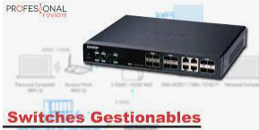

SOLUCIÓN WIFI PARA HOTELES CON HOTSPOT
=================================================================

¿Buscar una solución WiFi para Hoteles?
++++++++++++++++++++++++++++++++++++++++++

Con HotSpot puedes planificar el despliegue de la red WiFi en un hotel.

¿Cómo debe planificar el despliegue de la red WiFi?
++++++++++++++++++++++++++++++++++++++++++++++++++++++++

Primero debemos pensar qué queremos hacer, a quién queremos dar WiFi, y dónde queremos tener cobertura. Si pretende dar un buen servicio, se debe realizar un correcto estudio e ingeniería previa a la toma final de decisión de desplegar la red WiFi en tus instalaciones.

¿A quién queremos dar cobertura WiFi?
+++++++++++++++++++++++++++++++++++++++++++

La respuesta puede parecer obvia, **“a todos los clientes del hotel”**, pero no estamos hablando de personas, sino que el WiFi se entrega a **dispositivos del clientes**, y ahí es donde debemos tener cuidado, ya que no es lo mismo que nuestro **cliente WiFi** sea un portátil, una tablet o un teléfono móvil (smartphones). Este último siendo el peor **cliente WiFi** que podemos tener en nuestros escenarios.

Concurrencia de clientes
--------------------------

Se trata del número de clientes conectados a la vez; no tienen por qué estar navegando. Como norma, siempre hemos de estimar el número de clientes del Hotel conectados a la red WiFi que en general, no será muy inferior al número de habitaciones.

Muchos huéspedes del hotel conectan su SmartPhone a la red WiFi para descargar sus correos o para conectarse a las redes sociales, en esos casos están navegando y utilizando ancho de banda de nuestra red pero cuando acaban de consultar sus datos, no desconectan la función WiFi del móvil, por tanto, continúan conectados ocupando una conexión (que es un medio finito en los AP’s) y aunque no naveguen ni consuman ancho de banda, sí ocupan conexiones al AP al cual estén asociados.

Áreas problemáticas a cubrir en un Hotel
--------------------------

Suelen ser aquellas áreas donde puedan concentrarse una gran cantidad de usuarios simultáneos; sala de conferencias, piscina, recepción, etc.

Por ejemplo,una sala de conferencias; digamos que tiene unas dimensiones de 30x30m. Si en dicha sala se instalan 30/50/100 personas y todas ellas con un dispositivo cliente WiFi. Un AP normal será incapaz de manejar todas esas conexiones simultáneas y aún peor, de dar capacidad de navegación

Debemos plantearnos instalar más Puntos de Acceso para que puedan soportar la carga de clientes entre todos los APs.

Planificación Técnica
--------------------------

Vamos a realizar un ejemplo con un Hotel tipo con las siguientes características:

- 100 habitaciones
- 2 salas de multiusos, reuniones/congresos, 1 con 40 posibles usuarios WiFi, y otra con un aforo de 100 usuarios
- 1 Hall (con zona común)
- Cafetería
- 1 Restaurante con un aforo de 200 comensales
- 1 zona de Piscina al aire libre con una superficie aproximada de 10m2
- 1 terraza/bar en la zona de piscina con capacidad para 80 personas
- 1 Zona de Oficinas, back Office, administración y gerencia con capacidad para 15 empleados

Infraestructura red actual
--------------------------

- Recepción: 2 PCs para el Check-in y Check-out de los clientes
- Oficinas: 15 PCs y varias impresoras
- Cafetería: 1 TPV y 2 PDAs inalámbricas
- Restaurante: 2 TPVs y 3 PDAs inalámbricas
- Bar/terraza: 1 TPV y 1 PDA inalámbrica
- Ancho de Banda: 1 línea de ADSL de 20Mbps/1Mbps
- Requisitos del Cliente (Hotel)

Dotar de infraestructura WiFi a todo el Hotel (tanto clientes, como empleados) y aprovecharla para la instalación de cámaras de Vídeovigilancia en varias zonas (piscina, terrazas, Hall y otras zonas).

El Hotel realiza una subdivisión de zonas de servicios/clientes en base a los **clientes WiFi** que harán uso de la red:

- Cliente estándar
- Cliente VIP
- Clientes de Cortesía
- Clientes Salones de congresos
- Empleados zonas servicios (mantenimiento, externos, etc.)
- Administración/Gerencia
- Cámaras de Video-vigilancia

Planificación por tipo de cliente WiFi
------------------------------------------

-Cliente Estándar: 
 -Dispondrá de una conexión con una velocidad limitada a 256Kbps, y con la duración que consideremos (horas, dias..). Cuando realice el Check-In el personal de recepción le facilitará los datos de la red WiFi.

-Cliente VIP: 
 -Conexión con una velocidad limitada a 512Kbps de un día de duración.

-Clientes de Cortesía: 
 -Conexión de 128Kbps durante 30 min. desde el momento que se de alta, o durante 24 horas. También para clientes que hagan consumiciones en Cafetería o Restaurante

-Clientes de Salones de congresos: 
 -256Kbps durante el horario del congreso.

-Empleados PDAS:
 -128kbps con acceso a la red interna.

-Empleados zonas de servicio:
 -mantenimiento 128Kbps podrán navegar por Internet y acceso a la red interna del hotel.

-Administración/gerencia:
 -512Kbps con acceso a red interna y navegación por Internet

-Cámaras de VídeoVigilancia:
 -512Kbs y sin navegación.

Estimación usuarios simultáneos y de anchos de banda totales simultáneos
--------------------------

- 50 Cliente estándar x 256Kbps=12800Kbps =12,8Mbps
- 12 Cliente VIP x 500Kbps=6000Kbps = 6,0Mbps
- 10 Clientes de Cortesía 256Kbps= 2500Kbps = 2,5Mbps
- 120 Clientes Salones de congresos 256Kbps =30,7Mbps
- 8 Empleados con PDAS (sin Acceso a Internet) 0 Consumo de ADSL = 0
- 4 Empleados zonas servicios x 256Kbps=1024Kbps = 1,0Mbps
- 15 Administración/Gerencia x 512Kbps= = 7,5Mbps
- 10 Cámaras de Video-vigilancia x 512Kbps 0 Consumo de ADSL = 0
- TOTALES:231 Usuarios simultáneos y con un caudal total de = 60,5Mbs

En una situación de consumo **“máximo”** podemos precisar de al menos **60Mbps**, en otro caso sufriremos cuellos de botella en el supuesto de que se conecten más dispositivos de los estimados.

**Importante:** Como ves, el máximo caudal lo precisaremos en las salas de congresos, pero hemos sido cautos con los usuarios estándar y solo hemos previsto que estén conectados un porcentaje medio, porque el uso de las salas de congresos se hacen habitualmente en horario diurno, muchos de los usuarios de esas salas, además suelen ser huéspedes, con lo cual, no hacen uso de dos redes simultáneamente.

Ya tenemos algo importante por donde empezar, en este caso de abajo arriba, es decir, de la calle hasta el cliente final.--> ***El proveedor de ISP, ofrece un ADSL a un máximo de 20Mbps, precisaríamos de al menos 3 ADLS.***

Elementos / Productos necesarios para instalación de Red WiFi en "Hotel tipo"
-------------------------------------

Estos son los productos que recomendaríamos para la instalación de la red WiFi en un hotel con las características técnicas y necesidades que hemos citado anteriormente.

Agregador/Balanceador
----------------

Necesitamos un dispositivo capaz de al menos gestionar 3 ADSL de 20Mbps= 60Mbs, pero además, ha de ser capaz de gestionar todas las peticiones de 250 usuarios simultáneos.

Debe ser un hardware adecuado a las dimisiones y el trabajo que se espera va a realizar, tener un procesador capaz, y una memoria contundente para manejar el tráfico total. En este caso, estaríamos hablando por ejemplo, de un Agregador/Balanceador Peplink PL 380 capaz de 200Mbps Agregados (entrada y salida) puertos Gigabyte y capacidad de gestionar el doble de usuarios, unos 500 en total.

Firewall Avanzado
----------------------

Nuestra red ha de ser segura. Para que los paquetes de archivos sean acometidos en una primera instancia utilizaremos un Firewall avanzado, que reducirá significativamente el tráfico y caudal, llegando a gestionar todos los paquetes autorizados o no autorizados, lo que significa importantes ahorros de ADSL.

Gestor de clientes (HotSpot)
--------------------------------

Tal vez podemos decir que éste es el elemento más importante de nuestro proyecto.

Sabemos que podemos tener unos picos de usuarios de 250 clientes simultáneos; debemos seleccionar un **HOTSPOT WLAN CONTROLLER** adecuado a las necesidades. No podemos instalar un equipo con menos capacidad, pues no será capaz de manejar la gestión de todos los usuarios y todo el tráfico de nuestra red eficientemente (WiFi y cableada):

- ¿Quién se conecta?
- ¿Cuándo se conecta?
- ¿A qué velocidad Kbps se conectará?
- ¿Queremos limitar el acceso por tamaño de tráfico o por tiempo?
- ¿Zonas autorizada desde dónde conectarse?
- Gestionar y/o tarificar los tiempos de conexión de acuerdo a la política que hemos marcado
- Guardar un Log de todas las conexiones para saber quién y cuándo se ha conectado.

Switchs Gestionables
---------------------

Ya sabemos que el Hotel tipo va a disponer de tres grandes áreas diferenciadas, (parte pública, parte interna y circuito de vídeovigilancia) con lo que un cliente del hotel, jamás ha de poder acceder a la red interna. La red interna porjamas debe perturbar la red de Clientes.

Por su parte, la administración y empleados autorizados, sí deben tener acceso desde la red WiFi Pública a la red Interna del hotel con total seguridad y garantías.

Los diferentes switch que se instalen en el hotel deben disponer de la capacidad de alimentación POE para poder a través del propio cableado de red, alimentar los diferentes dispositivos WiFi o cámaras IP.

Si trabajamos con un escenario donde existan varias zonas de servicio, necesitaremos switches que trabajen con VLANs.

